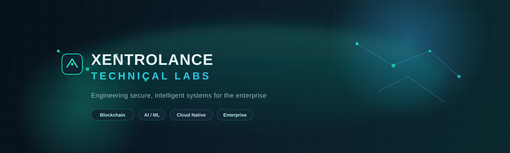
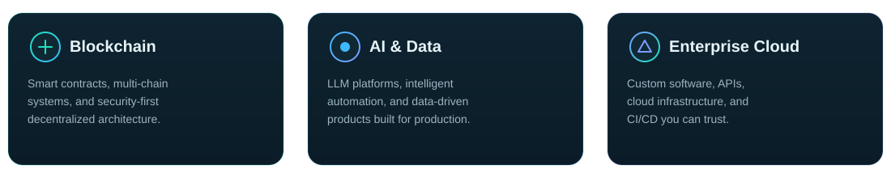
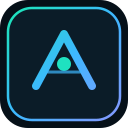

<!--
  Xentrolance Technical Labs - Organization Profile
  Renders on the GitHub organization home page.
  Repository must be named `.github` and be public.
-->

<div align="center">

  

  <br/>

  

  <br/><br/>

  <a href="https://xentrolance.com/">
    
  </a>
  <a href="https://www.linkedin.com/company/xentrolance">
    
  </a>
  <a href="mailto:hello@xentrolance.com">
    
  </a>

</div>

<br/>


## About Us

**Xentrolance Technical Labs** is the engineering arm of [Xentrolance Technologies Inc](https://xentrolance.com/) - an enterprise-focused technology company specializing in **Blockchain**, **Artificial Intelligence**, and **secure distributed systems**.

We help organizations **design, build, and scale** production-ready software that supports mission-critical operations and long-term growth. Our work combines deep technical expertise with disciplined engineering practices - security, scalability, and reliability first.

> *Engineering secure, intelligent systems for the enterprise.*


## What We Build

<div align="center">
  
</div>

<br/>

| Domain | Focus |
| :--- | :--- |
| **Blockchain** | Smart contracts, multi-chain tooling, security analysis, decentralized architecture |
| **AI / ML** | LLM integrations, automation pipelines, intelligent detection and analytics |
| **Software** | Product development, modernization, system integration, technical advisory |
| **Platform** | Cloud architecture, CI/CD, observability, secure infrastructure |


## Engineering Standards

We ship like a product company - not a black box vendor.

```text
+-------------------------------------------------------------+
|  [x] Source control required     [x] CI / CD on every change |
|  [x] Unit & integration tests    [x] Secure environments     |
|  [x] Transparent project mgmt    [x] Client owns IP & repos  |
|  [x] Small, focused teams        [x] Documented delivery     |
+-------------------------------------------------------------+
```

| Principle | What it means |
| :--- | :--- |
| **Transparency** | Shared visibility into progress, risks, and decisions |
| **Ownership** | Clients retain IP, documentation, and source repositories |
| **Quality** | Mandatory testing, reviews, and production-minded delivery |
| **Partnership** | Long-term collaboration over short-lived handoffs |


## Technology Landscape

<p align="center">
  
  
  
  
  
  <br/>
  
  
  
  
  
  <br/>
  
  
  
  
  
</p>


## Featured Workstreams

<details open>
<summary><strong>Valkra</strong> - AI-integrated smart contract security platform</summary>
<br/>

Multi-chain security analysis across **35+ blockchains**, **27+ languages**, and **45+ frameworks**. Combines static analysis, fuzzing, AST inspection, and AI-assisted detection into a rigorous audit pipeline.

`Rust` · `TypeScript` · `Next.js` · `PostgreSQL` · `Redis` · `LLM integrations`

</details>

<details>
<summary><strong>Enterprise Product Engineering</strong></summary>
<br/>

End-to-end product development and modernization for high-growth companies - from greenfield systems to complex integrations after M&A events.

</details>

<details>
<summary><strong>Architecture & Advisory</strong></summary>
<br/>

Technical leadership for blockchain, AI, and cloud initiatives - strategy, system design, risk management, and implementation oversight.

</details>


## Explore the Org

| | |
| :--- | :--- |
| **Repositories** | Browse our public labs, tools, and research |
| **Security** | See our [Security Policy](../SECURITY.md) |
| **Contributing** | Read our [Contributing Guide](../CONTRIBUTING.md) |
| **Code of Conduct** | Our [community standards](../CODE_OF_CONDUCT.md) |


## Let's Build Together

Whether you need a **blockchain security platform**, an **AI-powered product**, or a **mission-critical enterprise system** - we partner for the long haul.

<p align="center">
  <a href="https://xentrolance.com/">
    
  </a>
  &nbsp;
  <a href="https://www.linkedin.com/company/xentrolance">
    
  </a>
</p>

<p align="center">
  <sub>
    <b>Xentrolance Technical Labs</b><br/>
    Miami · Kyiv · Remote<br/>
    <a href="https://xentrolance.com/">xentrolance.com</a> ·
    <a href="https://www.linkedin.com/company/xentrolance">LinkedIn</a> ·
    (+1) (941) 404-5570
  </sub>
</p>

<p align="center">
  
</p>
